# Sorting Algorithms:

## Bubble Sort:

<h2> fig: Bubble Sort Animation </h2>

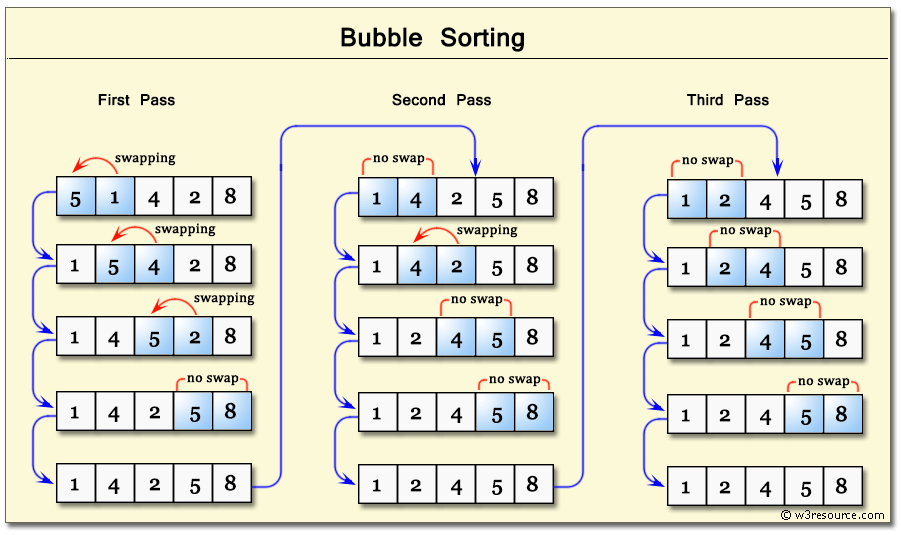
<h2> fig: Bubble Sort Example </h2>

### Leetcode:
Given an array of integers nums, sort the array in ascending order and return it.

- Input: nums = [5,2,3,1]
Output: [1,2,3,5]
Explanation: After sorting the array, the positions of some numbers are not changed (for example, 2 and 3), while the positions of other numbers are changed (for example, 1 and 5).

## Insertion Sort:

<h2> fig: Insertion Sort Animation </h2>

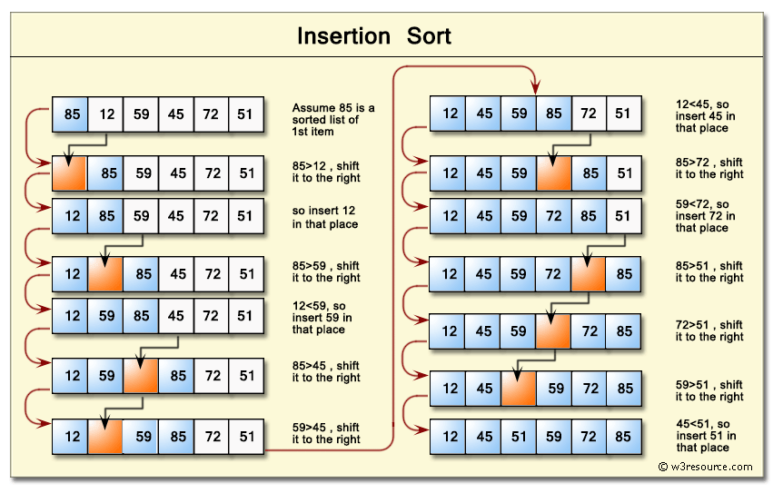
<h2> fig: Insertion Sort Example </h2>

# Selection Sort:

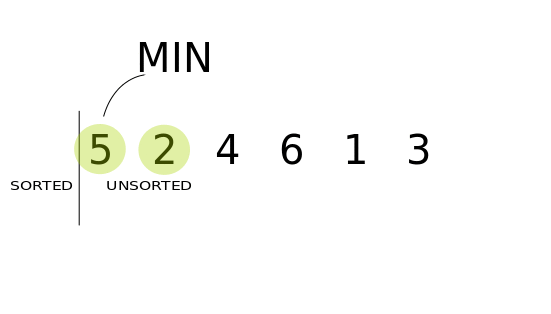
<h2> fig: Selection Sort Animation </h2>

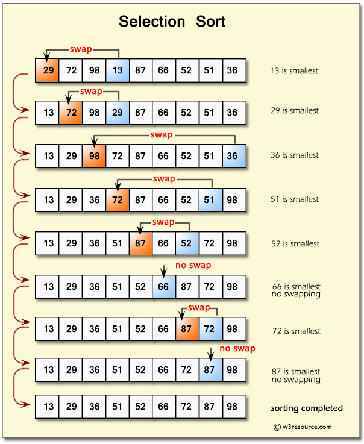
<h2> fig: Selection Sort Example </h2>

### Leetcode:(1913)
The product difference between two pairs (a, b) and (c, d) is defined as (a * b) - (c * d).

For example, the product difference between (5, 6) and (2, 7) is (5 * 6) - (2 * 7) = 16.
Given an integer array nums, choose four distinct indices w, x, y, and z such that the product difference between pairs (nums[w], nums[x]) and (nums[y], nums[z]) is maximized.

Return the maximum such product difference.

Example 1:

Input: nums = [5,6,2,7,4]
Output: 34
Explanation: We can choose indices 1 and 3 for the first pair (6, 7) and indices 2 and 4 for the second pair (2, 4).
The product difference is (6 * 7) - (2 * 4) = 34.
Example 2:

Input: nums = [4,2,5,9,7,4,8]
Output: 64
Explanation: We can choose indices 3 and 6 for the first pair (9, 8) and indices 1 and 5 for the second pair (2, 4).
The product difference is (9 * 8) - (2 * 4) = 64.

# Merge Sort:

<h2> fig: Merge Sort Animation </h2>

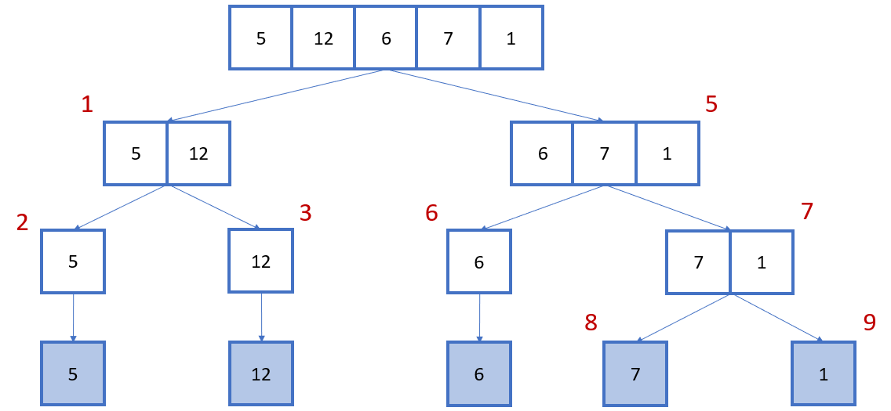
<h2> fig: Merge Sort step1 </h2>

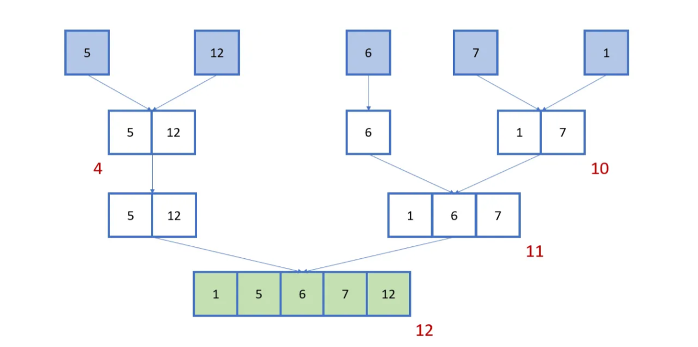
<h2> fig: Merge Sort step2 </h2>

### Leetcode:

You are given two integer arrays nums1 and nums2, sorted in non-decreasing order, and two integers m and n, representing the number of elements in nums1 and nums2 respectively.
Merge nums1 and nums2 into a single array sorted in non-decreasing order.
The final sorted array should not be returned by the function, but instead be stored inside the array nums1. To accommodate this, nums1 has a length of m + n, where the first m elements denote the elements that should be merged, and the last n elements are set to 0 and should be ignored. nums2 has a length of n.
 
Example 1:

Input: nums1 = [1,2,3,0,0,0], m = 3, nums2 = [2,5,6], n = 3
Output: [1,2,2,3,5,6]
Explanation: The arrays we are merging are [1,2,3] and [2,5,6].
The result of the merge is [1,2,2,3,5,6] with the underlined elements coming from nums1.
Example 2:

Input: nums1 = [1], m = 1, nums2 = [], n = 0
Output: [1]
Explanation: The arrays we are merging are [1] and [].
The result of the merge is [1].
Example 3:

Input: nums1 = [0], m = 0, nums2 = [1], n = 1
Output: [1]
Explanation: The arrays we are merging are [] and [1].
The result of the merge is [1].
Note that because m = 0, there are no elements in nums1. The 0 is only there to ensure the merge result can fit in nums1.

# Quick Sort:

<h2> fig: Quick Sort Animation </h2>

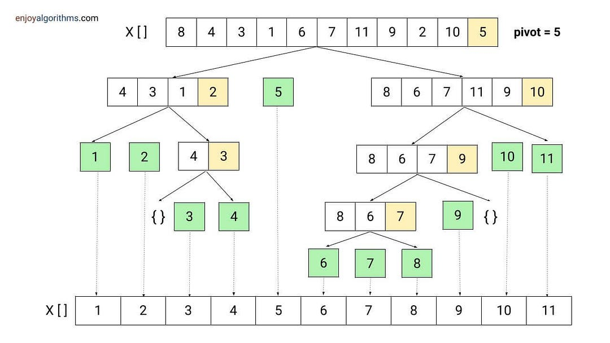
<h2> fig: Quick Sort step1 </h2>

### Leetcode:

Given an array of integers nums, sort the array in ascending order and return it.

You must solve the problem without using any built-in functions in O(nlog(n)) time complexity and with the smallest space complexity possible.

 

Example 1:

Input: nums = [5,2,3,1]
Output: [1,2,3,5]
Explanation: After sorting the array, the positions of some numbers are not changed (for example, 2 and 3), while the positions of other numbers are changed (for example, 1 and 5).
Example 2:

Input: nums = [5,1,1,2,0,0]
Output: [0,0,1,1,2,5]
Explanation: Note that the values of nums are not necessarily unique.

| Algorithm | Time Complexity | Space Complexity | Stability |
|-----------|-----------------|------------------|-----------|
| bubble sort | O(n^2) | O(1) | Stable |
| insertion sort | O(n^2) | O(1) | Stable |
| selection sort | O(n^2) | O(1) | Unstable |
| merge sort | O(n log n) | O(n) | Stable |
| quick sort | O(n log n) | O(log n) | Unstable |

| algorithm | used when |
|-----------|-----------|
| bubble sort | when the array is already sorted or nearly sorted (O(n)) |
| insertion sort | when the array is already sorted or nearly sorted (O(n)) |
| selection sort | when memory is limited and the array is small (O(n^2)) |
| merge sort | when stability is required or when dealing with large datasets that don't fit in memory (O(n log n)) |
| quick sort | when in-memory sorting of small to medium-sized arrays is needed and average-case performance is preferred (O(n log n)) |

# Linerar Search:

### Leetcode:

You are given a sorted array consisting of only integers where every element appears exactly twice, except for one element which appears exactly once.

Return the single element that appears only once.

Your solution must run in O(log n) time and O(1) space.

 

Example 1:

Input: nums = [1,1,2,3,3,4,4,8,8]
Output: 2
Example 2:

Input: nums = [3,3,7,7,10,11,11]
Output: 10

# Binary Search:

### Leetcode:

Given an array of integers nums which is sorted in ascending order, and an integer target, write a function to search target in nums. If target exists, then return its index. Otherwise, return -1.

You must write an algorithm with O(log n) runtime complexity.

 

Example 1:

Input: nums = [-1,0,3,5,9,12], target = 9
Output: 4
Explanation: 9 exists in nums and its index is 4
Example 2:

Input: nums = [-1,0,3,5,9,12], target = 2
Output: -1
Explanation: 2 does not exist in nums so return -1

# Trees:

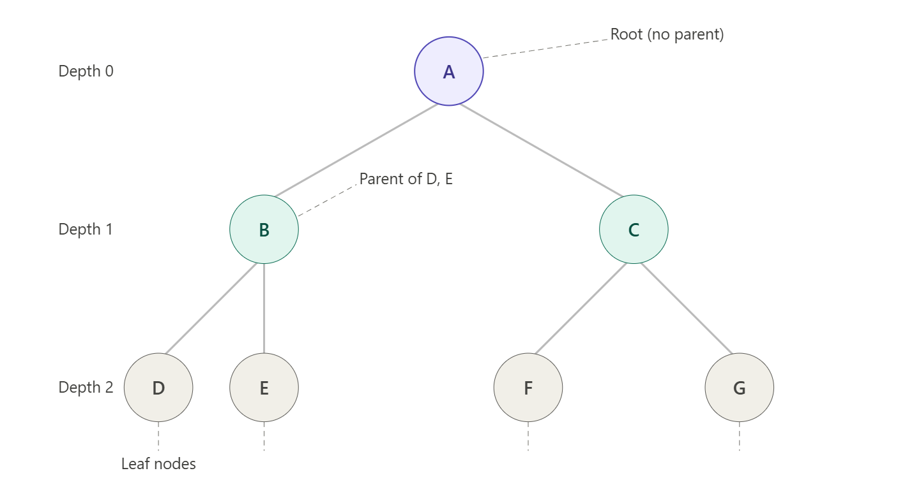
<h2> fig: Binary Search Tree </h2>

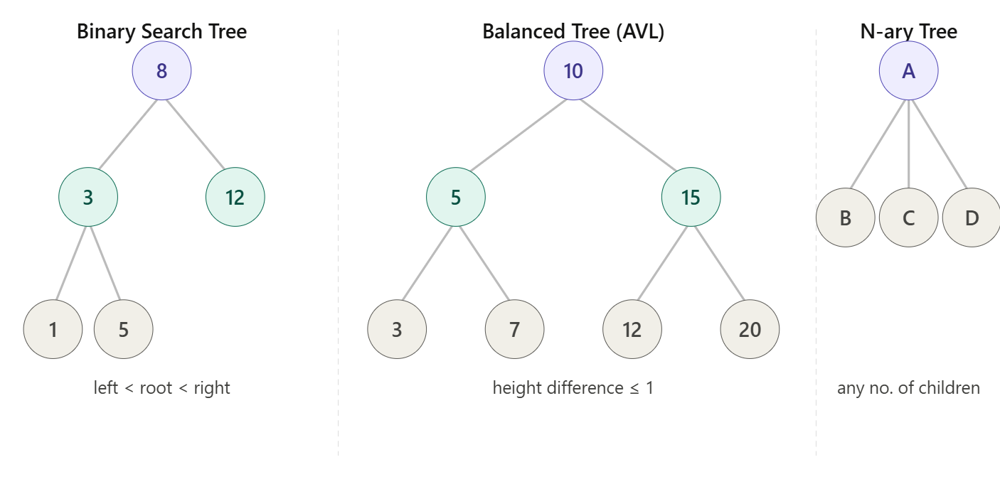
<h2> fig: Different Types of Trees </h2>

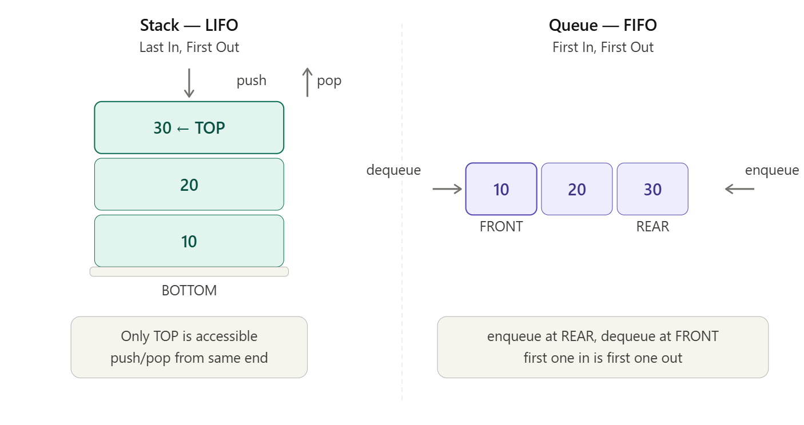
<h2> fig: Stack and Queue </h2>

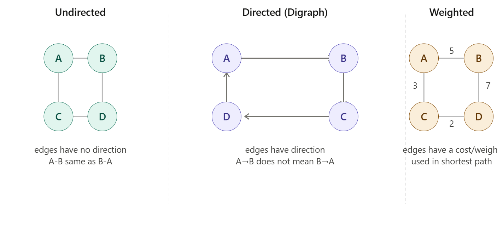
<h2> fig: Graphs </h2>

# Singly Linked List:

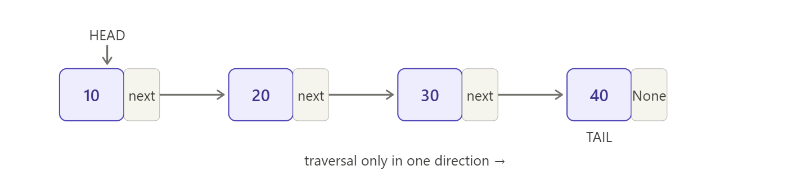
<h2> fig: Singly Linked List </h2>

# Doubly Linked List:

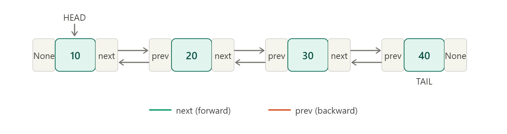
<h2> fig: Doubly Linked List </h2>

# Circular Linked List:

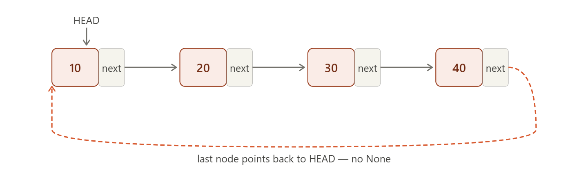
<h2> fig: Circular Linked List </h2>

